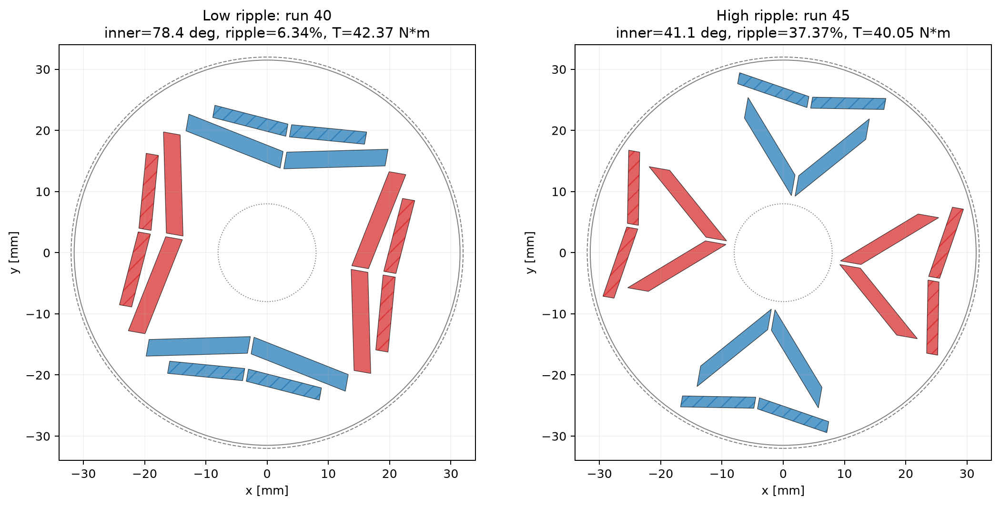

# Motor electromagnetic FEMM analysis

pyFEMM과 FEMM 2D 유한요소해석을 이용한 전동기 설계·최적화 연구 저장소다. 설계 의도, DOE 구성, 대리모델 탐색, FEMM 재검증과 물리 해석을 모터 구조별 리포트로 정리한다.

## Repository structure

```text
reports/
├── single_layer_v_ipm/
│   ├── 01_axis_shortedge_doe/
│   └── 02_dnn_candidate_search/
├── double_layer_ipm/
│   ├── 01_ccf_50point/
│   ├── 02_55to90_surrogate_validation/
│   ├── 03_best_worst_flux_path/
│   ├── 04_independent_angle_sobol/
│   └── 05_inner_angle_ripple_physics/
└── radial flux motor/
    ├── radial_vs_halbach_comprehensive_report.ipynb
    ├── models/
    ├── outer_rotor_36s30p_hairpin/
    └── scripts/
```

각 보고서 폴더에는 실행 결과가 포함된 Jupyter notebook, 대표 그림, 원본 요약 데이터와 재현용 pyFEMM 스크립트가 들어 있다.

## Single-layer V-IPM baseline

[싱글레이어 axis-shortedge 기준설계 리포트](reports/single_layer_v_ipm/README.md)는 4인자 CCF 50점과 DNN 1,000점 후보 탐색으로 더블레이어 비교의 기준선을 정의한다.

- Magnet thickness, length, V-angle, tip gap의 4인자 DOE
- 회전자 위치별 평균토크와 peak-to-peak 토크리플 계산
- Pareto front와 2차 반응표면 분석
- DNN ensemble을 이용한 1,000개 후보 탐색
- 대표점: 최대토크 Run 27 **51.07 N·m**, 균형점 Run 49 **46.76 N·m / 4.69 N·m pk-pk**

**[Single-layer 전체 리포트 보기 →](reports/single_layer_v_ipm/README.md)**

## Double-layer IPM design study

[](reports/double_layer_ipm/README.md)

두 겹의 V형 영구자석을 갖는 IPM 로터에서 자석 배치가 평균토크, 토크리플과 자석 사용량에 미치는 영향을 분석했다.

- 결합형 4인자 CCF 50점 DOE
- 55–90° 확장 DOE와 DNN ensemble 탐색
- 최적 후보 5개의 실제 FEMM 재검증
- 내·외측각 독립 Sobol 64점 분석
- 공극자속 FFT와 Maxwell stress 기반 리플 원인 분석

**[Double-layer 전체 리포트 보기 →](reports/double_layer_ipm/README.md)**

## Radial flux motor: Radial vs. 3-segment Halbach

동일한 36슬롯·30극 외전형 Hairpin PMSM에서 일반 Radial 자석과 3분할 quasi-Halbach 배열을 비교했다. 무부하·저전류 기준점부터 0–50 A 비선형 포화, 회전자 위치별 평균토크와 리플, 회전자 백아이언 1.50–5.00 mm 두께 스윕까지 하나의 보고서로 통합했다.

<p align="center">
  
  
</p>

<p align="center"><em>50 A, 2.5 mm 회전자 백아이언: Radial(왼쪽)과 3분할 Halbach(오른쪽). 컬러바 범위가 달라 정량 비교는 보고서의 P99/max 값을 사용한다.</em></p>

- Halbach 공극 기본파는 약 **1.5% 높고**, 외부 누설자속은 약 **58% 낮다**.
- 15 A 정밀 위치 스윕에서 Halbach 평균토크는 **3.33% 증가**, peak-to-peak 토크리플은 **53.48% 감소**했다.
- 두 설계 모두 50 A까지 토크는 증가하지만, 증분토크는 저전류 대비 약 **27–29% 감소**해 포화에 따른 평탄화가 나타난다.
- 동일한 5 mm 백아이언에서는 Halbach의 토크 이득이 약 1–3.4%지만, 낮은 회전자 요크 자속을 이용하면 더 얇은 백아이언과 낮은 회전자 관성을 검토할 수 있다.
- 현재 전자기 해석이 제시하는 두께 검토 범위는 **Radial 3.75–4.00 mm**, **Halbach 2.50–2.75 mm**다. 1.6/1.7 T는 절대 합격선이 아니라 설계 참고선이다.

**[Radial–Halbach 종합 노트북 보기 →](reports/radial%20flux%20motor/radial_vs_halbach_comprehensive_report.ipynb)**

**[관련 데이터·모델·스크립트 보기 →](reports/radial%20flux%20motor/README.md)**

## Environment and scope

- Windows
- [FEMM](https://www.femm.info/wiki/HomePage)
- Python / pyFEMM
- Jupyter Notebook

해석 결과는 2D FEMM 모델과 각 실험에서 정의한 운전조건에 기반한다. 속도 의존 역기전력과 인버터 전압 제한, 철손·동손·열, 감자 및 구조강도는 각 보고서의 범위와 주의사항을 확인해야 한다.
