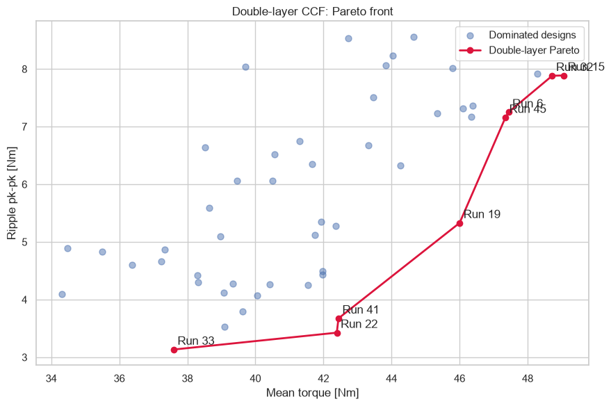
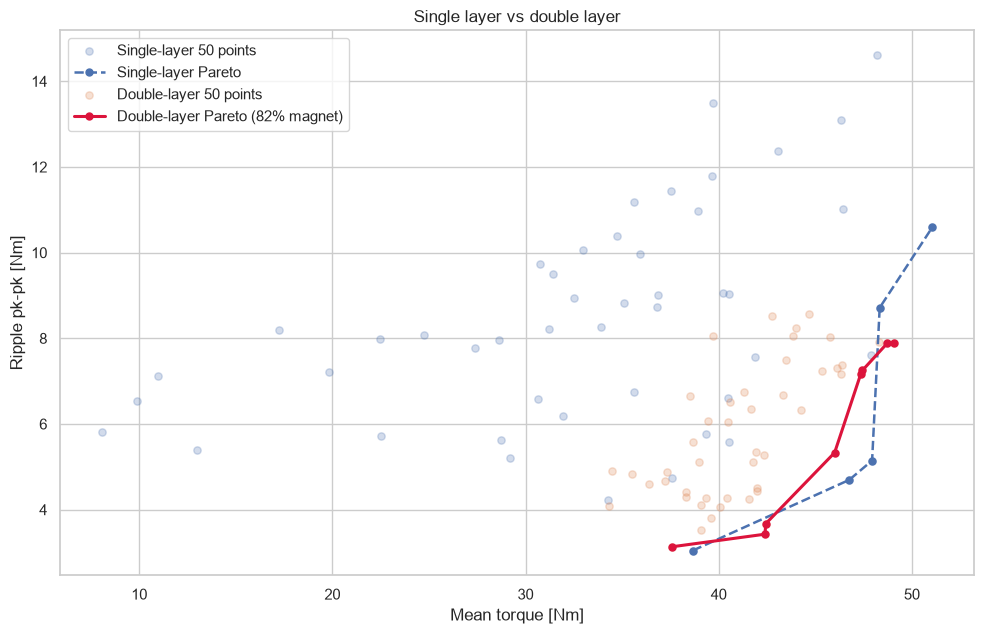

# 01 · Double-layer CCF 50-point DOE

## 목적

내·외측 V자석의 각도와 면적비를 결합한 4인자 CCF 설계 50점을 해석해, 자석 사용량을 줄이면서 평균토크와 토크리플을 유지할 수 있는지 확인했다. 설계당 15개 로터 위치, 총 **750개 FEMM 운전점**을 사용했다.

## 주요 결과

| 대표 설계 | 평균토크 | 토크리플 pk-pk | 의미 |
|---|---:|---:|---|
| Run 33 | 37.60 N·m | 3.13 N·m | 최저 리플 영역 |
| Run 22 | 42.39 N·m | 3.43 N·m | 저리플 절충점 |
| Run 19 | 46.00 N·m | 5.33 N·m | 실용 균형점 |
| Run 15 | 49.06 N·m | 7.89 N·m | 최대 평균토크 |

Run 19는 비교 싱글레이어에 가까운 평균토크를 유지하면서 자석량을 약 **18% 절감**했다. 반복 교차검증의 결정계수는 평균토크 **0.959**, 리플 **0.979**였다.

## 해석

초기 DOE만으로도 더블레이어가 단순한 자석 추가가 아니라 토크–리플–자석량 사이의 새로운 절충영역을 만든다는 가능성을 확인했다. 다만 이 설계에서는 내·외측 각도와 외측 자석비가 결합되어 각 레이어의 역할을 독립적으로 설명할 수 없다.

## 파일

- [실행 결과 전체 노트북](analysis.ipynb)
- [50점 FEMM 요약 데이터](data/double_layer_ccf_summary.csv)
- `scripts/`: DOE 생성 및 분석 노트북 생성 코드
