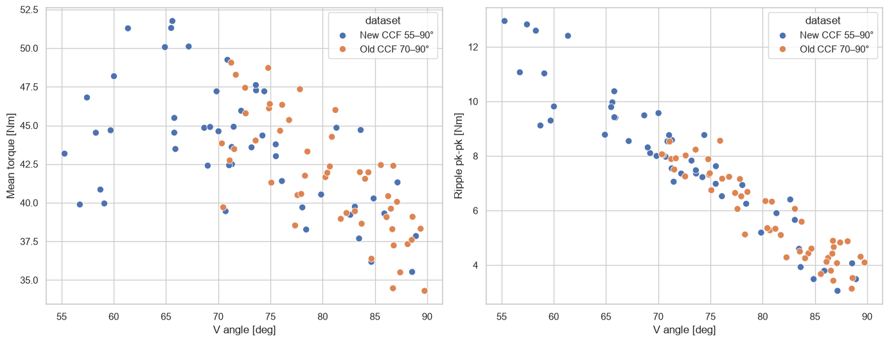
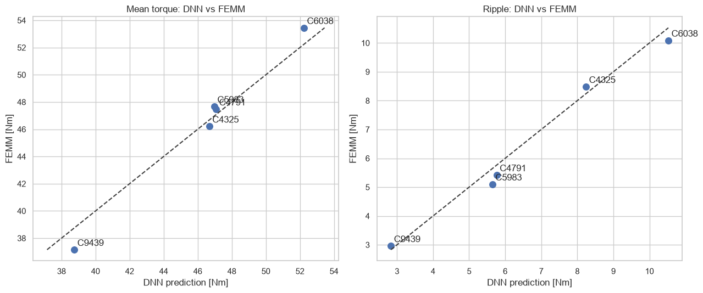
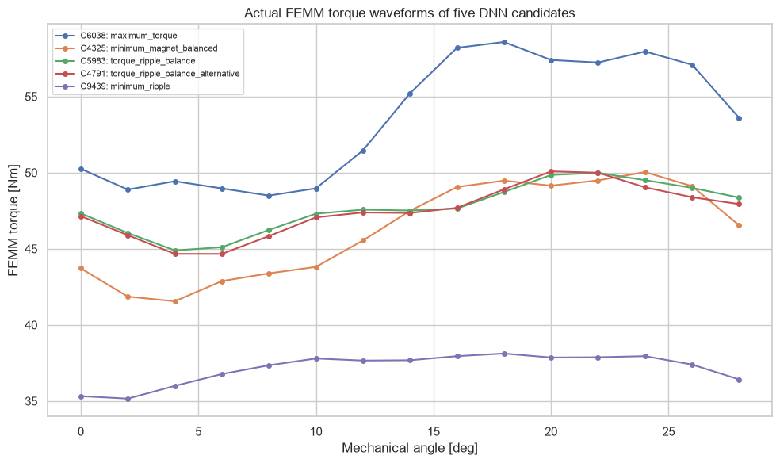

# 02 · 55–90° surrogate optimization and FEMM validation

## 목적

더블레이어 자석각 범위를 55–90°로 확장한 FEMM 100점으로 DNN ensemble을 학습하고, 형상검사를 통과한 10,000개 후보를 탐색했다. 이후 목적이 다른 후보 5개를 FEMM으로 다시 해석해 예측의 신뢰도를 확인했다.

## 실제 FEMM 검증 결과

- 평균토크 예측 RMSE: **0.99 N·m**
- 토크리플 예측 RMSE: **0.37 N·m pk-pk**
- C6038: **53.45 N·m / 10.09 N·m pk-pk** — 최대토크 영역
- C5983: **47.67 N·m / 5.10 N·m pk-pk** — 가장 유용한 균형점

## 해석

C6038은 싱글레이어 최대점보다 자석을 약 9% 줄이면서 평균토크를 약 4.7% 높였다. 반면 저리플로 예측된 후보의 우위는 실제 FEMM에서 확인되지 않아, surrogate 최적점은 반드시 재해석해야 한다는 점도 드러났다.

## 한계

고정 운전점 결과이며 코깅, THD, 약계자, 철손, 열 및 구조 조건은 포함하지 않았다.

## 파일

- [실행 결과 전체 노트북](analysis.ipynb)
- [확장 DOE 요약](data/double_layer_ccf_summary.csv)
- [FEMM 검증 5개 설계](data/double_layer_validation_5_designs.csv)
- `scripts/`: DOE, surrogate 분석 및 검증 후보 생성 코드
