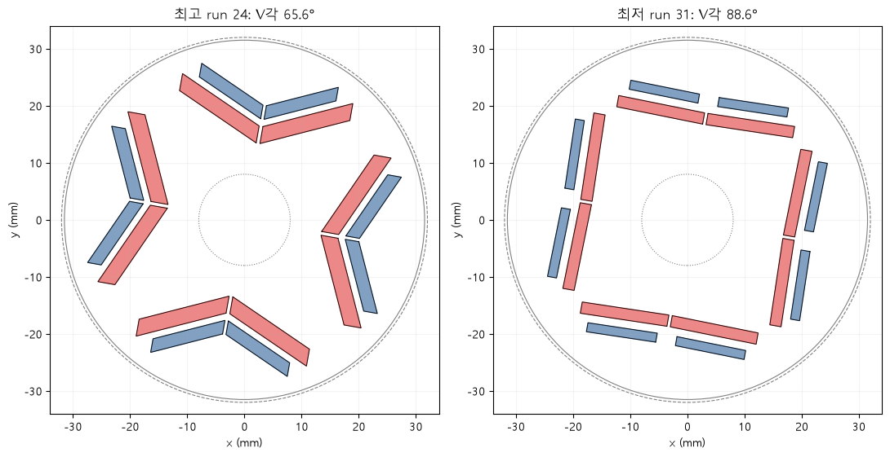
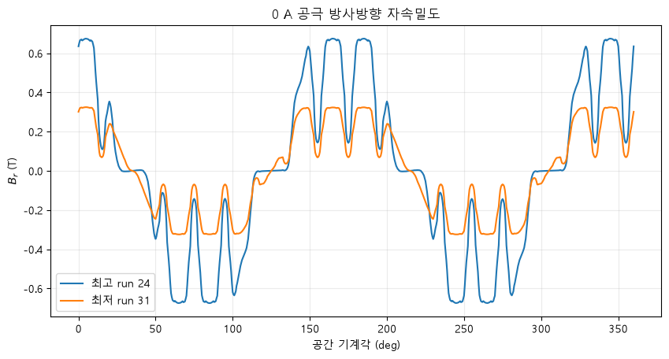

# 03 · Best–worst flux-path comparison

## 목적

평균토크 최고·최저 설계를 나란히 놓고 자석 배치, 0 A 공극 자속, 그리고 1차 자기등가회로 관점에서 성능 차이의 원인을 분리했다.

## 관찰 결과

- 최저 Run 31의 평균토크는 최고 Run 24보다 **31.4% 낮았다**.
- 0 A 공극자속 공간 2차 기본파는 Run 31이 **0.289 T**, Run 24가 **0.549 T**였다.
- 따라서 최저 설계의 PM 자속 기본파는 최고 설계의 **52.6%** 수준이다.

## 무엇까지 설명되는가

이 결과는 PM 자속 감소를 직접 지지한다. 그러나 0 A 해석만으로는 증분 `Ld`, `Lq` 및 포화에 의한 릴럭턴스 토크 차이를 분리할 수 없다. 다음 검증은 순수 d축·q축 전류를 인가한 인덕턴스 맵이어야 한다.

## 파일

- [실행 결과 전체 노트북](analysis.ipynb)
- `scripts/`: 최고·최저 설계의 무부하 FEMM 비교 코드
