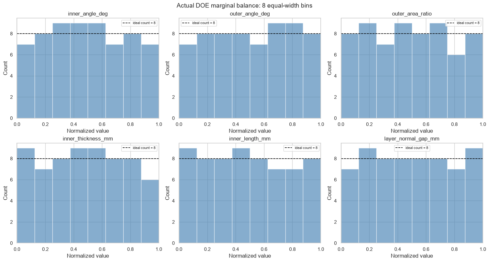
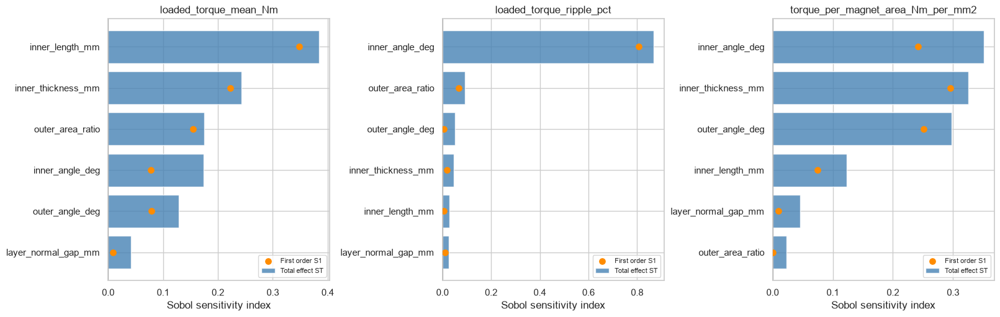

# 04 · Independent-angle Sobol 64-point study

## 목적

초기 설계에서 결합되어 있던 내측각, 외측각과 자석 치수를 6개 독립변수로 분리해 Sobol 64점 DOE를 구성했다. 평균토크, 리플, 자석효율에 각 변수가 미치는 경향을 대리모델과 상관분석으로 비교했다.

## 핵심 관찰

- 자석 길이·두께 계열은 평균토크 변화와 강하게 연결됐다.
- inner angle은 리플과 복합 토크품질에서 중요한 경향을 보였다.
- 복합지표 `J = Tmean / Tpk-pk`에 대한 inner-angle Spearman 상관은 **0.818**이었다.
- 진단용 Sobol 1차 지수에서 inner angle은 **0.562**였다.
- outer angle은 절대토크보다 자석 면적당 토크에서 살펴볼 가치가 있었다.

## 주의할 점

64점 대리모델과 고정 commutation angle에서 얻은 민감도이므로 수치는 설계 가설이다. 변수의 인과효과로 단정하지 않으며, 더 균형 잡힌 DOE와 조건부 commutation sweep이 필요하다.

## 파일

- [실행 결과 전체 노트북](analysis.ipynb)
- [Sobol 64점 FEMM 요약](data/independent_angle_summary.csv)
- `scripts/`: DOE 생성 및 분석 코드
