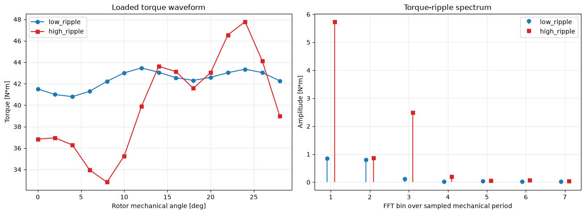
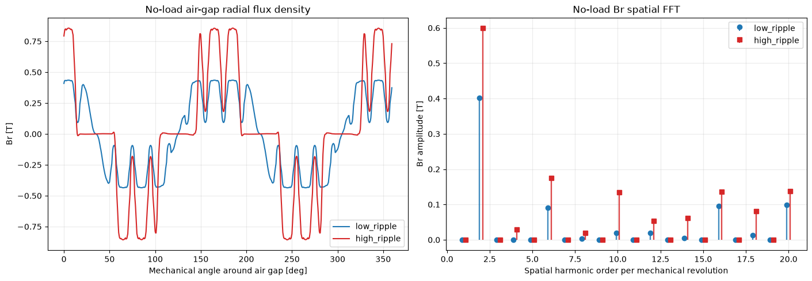

# 05 · Inner-angle torque-ripple physics check

## 목적

자석량이 비슷하지만 리플이 다른 설계쌍을 골라, 토크 파형과 FFT, 무부하 공극자속 고조파, 부하 Maxwell 전단응력을 차례로 비교했다.

## 정량 근거

- 고리플 형상의 토크밀도는 저리플 형상보다 **7.75% 낮았다**.
- 리플률은 **6.33% → 37.37%**로 증가했다.
- 자석 면적당 비기본파 RMS는 **84.1% 증가**했다.
- 고조파, 전단응력, 반경압력까지 네 가지 진단이 모두 같은 방향을 보였다.

## 결론과 한계

전체 로터 수준에서는 공극 고조파 증가가 큰 토크리플과 연결되는 일관된 근거 사슬을 얻었다. 다만 비교쌍의 자석면적이 2.48% 다르고 다른 변수도 완전히 고정되지 않았으므로, inner angle 하나의 순수 인과효과로 해석할 수는 없다.

## 파일

- [실행 결과 전체 노트북](analysis.ipynb)
- `data/`: 비교쌍 선정표와 실험 설정
- `scripts/`: 물리 검증 실행 및 리포트 생성 코드
