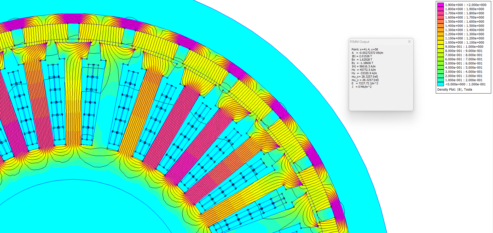
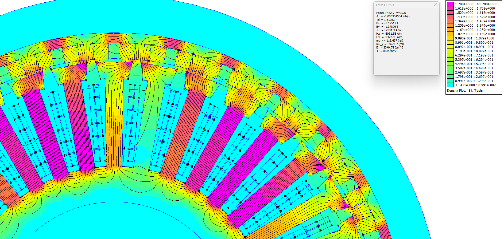

# 외전형 Radial–Halbach 자석 배열 비교 연구

> 동일한 36슬롯·30극 외전형 Hairpin PMSM에서 일반 Radial 자석과 3분할 quasi-Halbach 배열은 토크, 리플, 누설자속과 회전자 백아이언 설계에 어떤 차이를 만드는가?

이 연구는 비선형 2D FEMM 정자계 해석으로 두 자석 배열을 비교한다. 무부하와 1 A 기준점에서 시작해 0–50 A 전류 포화, 회전자 위치별 평균토크와 토크리플, 회전자 백아이언 1.50–5.00 mm 두께 스윕까지 분석했다.

## FEMM 자속밀도 비교

<p align="center">
  
  
</p>

<p align="center"><em>50 A, 2.5 mm 회전자 백아이언: Radial(왼쪽)과 3분할 Halbach(오른쪽). 컬러바 범위가 서로 다르므로 정량 비교는 노트북의 P99/max 값을 사용한다.</em></p>

## 한눈에 보는 결과

| 비교 항목 | 주요 결과 |
|---|---|
| 공극 기본파 | Halbach가 약 **1.5% 높음** |
| 외부 누설자속 | Halbach가 약 **58% 낮음** |
| 15 A 위치평균 토크 | Halbach가 **3.33% 높음** |
| 15 A peak-to-peak 토크리플 | Halbach가 **53.48% 낮음** |
| 0–50 A 포화 | 두 설계의 증분토크가 저전류 대비 약 **27–29% 감소** |
| 백아이언 검토 범위 | Radial **3.75–4.00 mm**, Halbach **2.50–2.75 mm** |

동일한 5 mm 백아이언에서는 Halbach의 평균토크 이득이 약 1–3.4%로 크지 않다. 그러나 Halbach는 회전자 요크 자속과 외부 누설이 훨씬 낮아, 얇은 백아이언·작은 외경·낮은 회전자 관성을 선택할 수 있는 설계 여유를 제공한다.

## 분석 흐름

```text
① 0 A 및 1 A 기준 성능
   공극 자속 · 외부 누설 · 정적 토크
                  ↓
② 1–15 A 초기 전류 스윕
   토크/A · 증분토크 · 철심 포화 경향
                  ↓
③ 15 A 정밀 회전자 위치 스윕
   위치평균 토크 · peak-to-peak 리플
                  ↓
④ 0–50 A 전류–위치 통합 해석
   비선형 평탄화 · 공극 FFT · 고정자 P99
                  ↓
⑤ 2.5 mm 백아이언 축소 실험
   Radial과 Halbach의 요크 포화 차이
                  ↓
⑥ 1.50–5.00 mm 전체 두께 스윕
   경계 두께의 한 전기주기 위치 검증
```

## 보고서와 자료

- **[실행 결과가 포함된 종합 Jupyter notebook →](radial_vs_halbach_comprehensive_report.ipynb)**
- [`models/`](models/): Radial, Halbach 및 2.5 mm 백아이언 대표 FEMM 모델
- [`outer_rotor_36s30p_hairpin/`](outer_rotor_36s30p_hairpin/): 노트북이 읽는 원본 CSV와 FEMM 캡처
- [`scripts/`](scripts/): 전류·위치·백아이언 스윕 및 보고서 재현 스크립트

노트북의 모든 셀은 이 폴더를 작업 디렉터리로 두면 다시 실행할 수 있다. `outer_rotor_36s30p_hairpin` 데이터 폴더를 노트북과 같은 위치에 유지해야 한다.

## 결과 해석 시 주의점

- 결과는 전류를 직접 지정한 2D FEMM 정자계 해석이다.
- 회전속도에 따른 역기전력과 인버터 전압 제한은 포함하지 않는다.
- 철손, 동손, 자석 와전류손, 열 상승, 감자 및 회전자 원심응력은 별도 검증이 필요하다.
- 보고서의 P99 1.6 T와 max 1.7 T 선은 절대적인 합격·불합격 기준이 아니라 설계 참고선이다.
- 최종 백아이언 두께는 실제 강판의 B–H·철손 데이터, 운전 듀티, 제조 공차와 구조 안전율을 함께 고려해 결정해야 한다.

대용량 FEMM `.ans` 해답 파일은 저장소 크기를 줄이기 위해 제외했다. 대표 `.fem` 모델과 원본 CSV, 실행된 노트북은 저장되어 있어 주요 결과를 검토하고 모델을 다시 해석할 수 있다.
