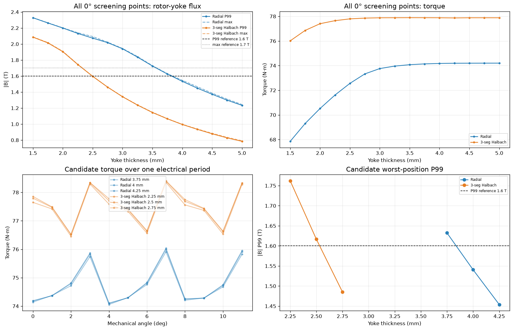

# 외전형 Radial–Halbach 자석 배열 비교 연구

> 동일한 36슬롯·30극 외전형 Hairpin PMSM에서 일반 Radial 자석과 3분할 quasi-Halbach 배열은 토크, 리플, 누설자속과 회전자 백아이언 설계에 어떤 차이를 만드는가?

이 연구는 비선형 2D FEMM 정자계 해석으로 두 자석 배열을 비교한다. 무부하와 1 A 기준점에서 시작해 0–50 A 전류 포화, 회전자 위치별 평균토크와 토크리플, 회전자 백아이언(rotor yoke) 1.50–5.00 mm 두께 스윕까지 분석했다. 이하에서는 같은 부품을 **백아이언**으로 통일해 부른다.

## FEMM 자속밀도 비교

<p align="center">
  
  
</p>

<p align="center"><em>50 A, 2.5 mm 회전자 백아이언: Radial(왼쪽)과 3분할 Halbach(오른쪽). 컬러바 범위가 서로 다르므로 정량 비교는 노트북의 P99/max 값을 사용한다.</em></p>

## 핵심 결론

전체 1.50–5.00 mm 스윕에서 Radial의 토크 감소는 약 **3.0 mm 아래**, Halbach는 약 **2.0 mm 아래**부터 가팔라진다. 5 mm 대비 토크 손실 1%의 교차 두께를 보간하면 Radial **2.83 mm**, Halbach **1.86 mm**다.

즉 동일한 1% 토크 손실을 허용할 때 Halbach는 Radial의 약 **0.66배 두께**만 필요하다. 반대로 Radial은 Halbach보다 약 **1.52배 더 두꺼운 백아이언**을 사용해야 같은 수준의 토크를 유지한다.



위 그림의 오른쪽 위 `All 0° screening points: torque`에서 두 설계의 토크 무릎점 차이를 직접 볼 수 있다. 왼쪽 위 그래프는 두께 감소에 따른 백아이언 자속 증가를, 아래 두 그래프는 경계 두께에서 한 전기주기 동안의 토크와 최악 위치 P99를 보여준다. 0° 전 두께 스크리닝으로 경향을 찾고 위치 스윕으로 경계안을 다시 확인한 결과다.

- **Radial:** 백아이언 자속이 약 2.08 T까지 상승하고 평균토크가 2.51%, 공극 기본파가 3.81% 감소한다.
- **Halbach:** 백아이언 자속은 약 1.59 T 수준이며 평균토크 손실은 0.05%에 불과하고 공극 기본파도 유지된다.
- 같은 2.5 mm 백아이언에서 Halbach 평균토크는 Radial보다 약 **6.27% 높다**.
- Halbach는 백아이언 두께가 기존 5 mm Radial의 **절반인 2.5 mm**임에도 평균토크가 약 **3.61% 높다**.

> Halbach의 핵심 가치는 토크 저하가 시작되는 백아이언 두께를 약 3.0 mm에서 2.0 mm 부근으로 낮추고, 절반 두께의 백아이언에서도 기존 5 mm Radial보다 높은 토크를 유지하는 데 있다.

## 한눈에 보는 결과

| 비교 항목 | 주요 결과 |
|---|---|
| 토크 감소가 가팔라지는 구간 | Radial 약 **3.0 mm 아래**, Halbach 약 **2.0 mm 아래** |
| 1% 토크 손실 보간 두께 | Radial **2.83 mm**, Halbach **1.86 mm** |
| 동일 손실 기준 필요 두께 | Halbach가 Radial의 약 **0.66배**, Radial이 약 **1.52배 두꺼움** |
| 2.5 mm Radial | 백아이언 P99 **2.08 T**, 토크 **-2.51%**, 공극 기본파 **-3.81%** |
| 2.5 mm Halbach | 백아이언 P99 **1.59 T**, 토크 **-0.05%**, 공극 기본파 **+0.07%** |
| 동일 2.5 mm 평균토크 | Halbach가 Radial보다 약 **6.27% 높음** |
| 5 mm Radial 대비 2.5 mm Halbach | 백아이언이 **절반 두께**인데 Halbach 평균토크가 약 **3.61% 높음** |
| 외부 누설자속 | Halbach가 약 **58% 낮음** |
| 15 A 토크리플 | Halbach peak-to-peak 리플이 **53.48% 낮음** |
| 백아이언 검토 범위 | Radial **3.75–4.00 mm**, Halbach **2.50–2.75 mm** |

1.6 T P99와 1.7 T max는 절대적인 합격·불합격 기준이 아니라 설계 참고선이다. 실제 두께는 강판 특성, 운전 듀티와 구조 안전율을 함께 고려해 위 검토 구간에서 선택해야 한다.

## 백아이언 경량화와 관성 효과

강판 밀도 7,650 kg/m³, 적층길이 150 mm, 백아이언 내반경 70 mm의 원통형 링으로 계산했다. 아래 질량과 극관성모멘트는 백아이언만의 값이며 자석·슬리브·허브·축은 포함하지 않는다.

| 후보 | 회전자 외경 | 백아이언 질량 | 질량 감소 | 백아이언 관성 감소 | 5 mm Radial 대비 토크 |
|---|---:|---:|---:|---:|---:|
| Radial 5.00 mm | 150.0 mm | 2.614 kg | 기준 | 기준 | 기준 |
| Radial 4.00 mm | 148.0 mm | 2.076 kg | 20.6% | 21.7% | -0.04% |
| Radial 3.75 mm | 147.5 mm | 1.943 kg | 25.6% | 27.0% | -0.10% |
| Halbach 2.75 mm | 145.5 mm | 1.415 kg | 45.9% | 47.6% | +3.65% |
| Halbach 2.50 mm | 145.0 mm | 1.284 kg | **50.9%** | **52.6%** | **+3.61%** |

> Halbach 2.50 mm는 5 mm Radial보다 백아이언 철 질량이 50.9%, 백아이언 극관성이 52.6% 작지만 평균토크는 3.61% 높다.

정격 및 최대 RPM은 현재 정자계 토크로 확정하지 않는다. 다음 단계에서 역기전력과 DC 링크 전압, 약계자 범위, 철손·열, 자석 유지 구조와 최대속도 원심응력을 결합해 산정한다.

## 분석 흐름

```text
① 0 A 및 1 A 기준 성능
   공극 자속 · 외부 누설 · 정적 토크
                  ↓
② 1–15 A 초기 전류 스윕
   토크/A · 증분토크 · 철심 포화 경향
                  ↓
③ 15 A 정밀 회전자 위치 스윕
   위치평균 토크 · peak-to-peak 리플
                  ↓
④ 0–50 A 전류–위치 통합 해석
   비선형 평탄화 · 공극 FFT · 고정자 P99
                  ↓
⑤ 2.5 mm 백아이언 축소 실험
   Radial과 Halbach의 백아이언 포화 차이
                  ↓
⑥ 1.50–5.00 mm 전체 두께 스윕
   경계 두께의 한 전기주기 위치 검증
```

## 보고서와 자료

- **[실행 결과가 포함된 종합 Jupyter notebook →](radial_vs_halbach_comprehensive_report.ipynb)**
- [`models/`](models/): Radial, Halbach 및 2.5 mm 백아이언 대표 FEMM 모델
- [`outer_rotor_36s30p_hairpin/`](outer_rotor_36s30p_hairpin/): 노트북이 읽는 원본 CSV와 FEMM 캡처
- [`scripts/`](scripts/): 전류·위치·백아이언 스윕 및 보고서 재현 스크립트

노트북의 모든 셀은 이 폴더를 작업 디렉터리로 두면 다시 실행할 수 있다. `outer_rotor_36s30p_hairpin` 데이터 폴더를 노트북과 같은 위치에 유지해야 한다.

## 결과 해석 시 주의점

- 결과는 전류를 직접 지정한 2D FEMM 정자계 해석이다.
- 회전속도에 따른 역기전력과 인버터 전압 제한은 포함하지 않는다.
- 철손, 동손, 자석 와전류손, 열 상승, 감자 및 회전자 원심응력은 별도 검증이 필요하다.
- 보고서의 P99 1.6 T와 max 1.7 T 선은 절대적인 합격·불합격 기준이 아니라 설계 참고선이다.
- 최종 백아이언 두께는 실제 강판의 B–H·철손 데이터, 운전 듀티, 제조 공차와 구조 안전율을 함께 고려해 결정해야 한다.

대용량 FEMM `.ans` 해답 파일은 저장소 크기를 줄이기 위해 제외했다. 대표 `.fem` 모델과 원본 CSV, 실행된 노트북은 저장되어 있어 주요 결과를 검토하고 모델을 다시 해석할 수 있다.
