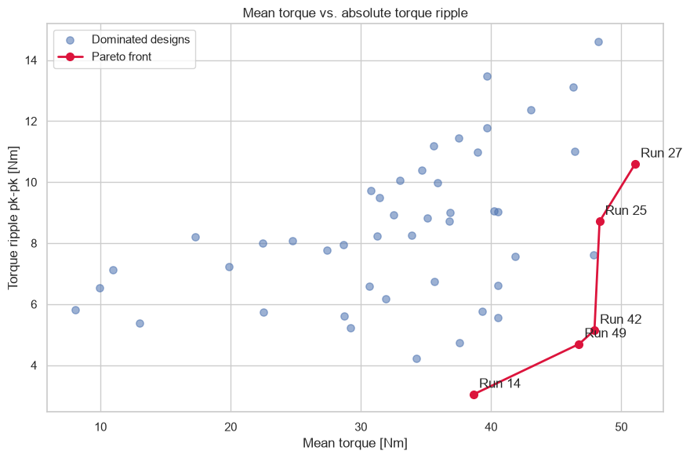

# 01 · Axis-shortedge CCF 50-point DOE

## 목적

싱글레이어 V-IPM의 자석 두께, 길이, V-angle과 tip gap을 4인자 CCF 50점으로
배치하고, 동일 운전조건에서 평균토크와 토크리플을 비교했다.

## 결과

- 최대토크 Run 27: **51.07 N·m / 10.60 N·m pk-pk**
- 균형점 Run 49: **46.76 N·m / 4.69 N·m pk-pk**
- 평균토크 모델 반복 CV `R²`: 약 **0.99**
- 리플 모델 반복 CV `R²`: 약 **0.77**

자석 길이는 평균토크에 큰 영향을 보였고, 리플은 V-angle과 변수 상호작용에
더 민감했다. 두 목적을 동시에 만족하려면 단일 변수 최적화가 아니라 Pareto
기반 선택이 필요하다.

## 자료

- [실행 결과 노트북](analysis.ipynb)
- [FEMM 50점 요약 데이터](data/axis_shortedge_ccf_summary.csv)
- `scripts/`: DOE 형상 생성과 결과 분석 코드
