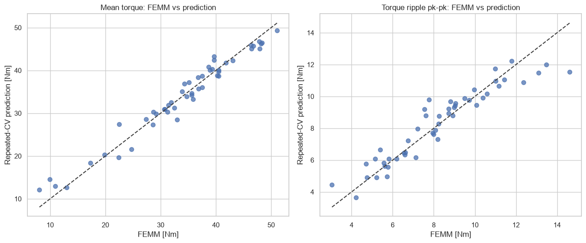

# 02 · DNN 1,000-candidate search

## 목적

50개 FEMM 결과로 DNN ensemble을 학습하고, 형상검사를 통과한 LHS 1,000점에서
토크–리플 Pareto 후보를 선별했다.

## 결과

- 평균토크 반복 CV `R²`: **0.962**
- 토크리플 반복 CV `R²`: **0.882**
- 형상검사 통과 영역에서 예측 Pareto 후보 생성

모델은 후속 FEMM 계산의 우선순위를 정하는 데 사용할 수 있다. 그러나 1,000개
예측값은 FEMM 해석값이 아니며, 학습점이 드문 영역과 경계 후보의 불확실성이
크다. 대표 Pareto 후보를 재해석해 학습자료에 추가하는 순차적 검증이 필요하다.

## 자료

- [실행 결과 노트북](analysis.ipynb)
- [DNN 예측 후보 1,000점](data/axis_shortedge_dnn_candidates_1000.csv)
- [예측 Pareto 후보](data/axis_shortedge_dnn_predicted_pareto.csv)
- `scripts/`: FEMM 결과 분석과 surrogate 생성 코드
