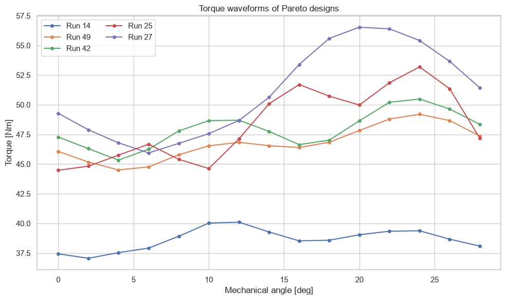
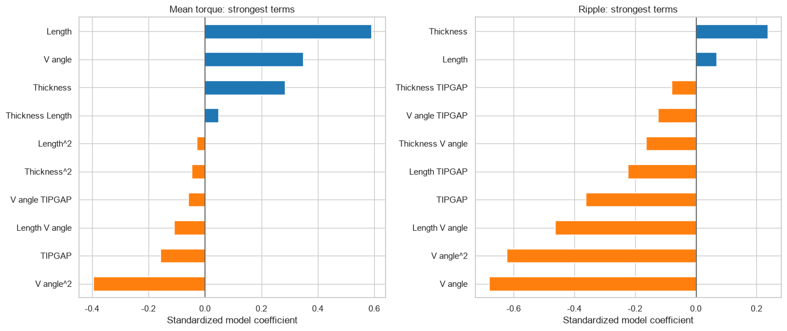
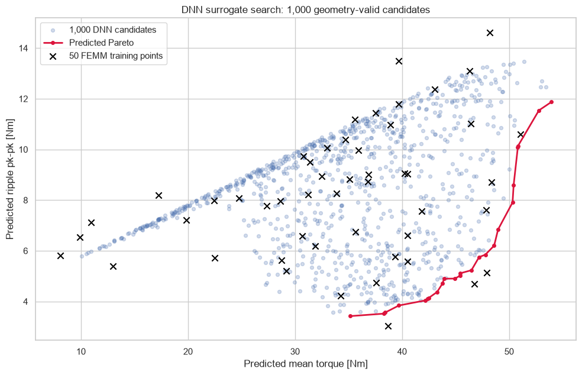

# Single-layer V-IPM baseline design study

> 더블레이어 로터를 평가하기 전에, 한 겹 V형 자석으로 얻을 수 있는 평균토크–토크리플 기준선을 정의한다.


## 설계 목적

싱글레이어 V-IPM 로터의 자석 형상을 파라메트릭하게 생성하고, 제한된 FEMM
해석으로 평균토크와 토크리플의 균형점을 찾았다. 자석의 짧은 변을 좌표축과
평행하게 유지하는 `axis-shortedge` 형상을 사용해 형상 생성의 일관성을
확보했다.

주요 설계변수는 다음과 같다.

- magnet thickness
- magnet length
- V-angle
- rotor bridge와 자석 끝단 사이의 tip gap

모든 DOE 설계는 동일한 10 A와 commutation offset 조건에서 비교했다. 각
설계의 회전자 위치별 토크 파형으로 평균토크와 peak-to-peak 리플을 계산했다.

## DOE와 탐색 흐름

```text
① 4인자 CCF 50점 생성
   thickness · length · V-angle · tip gap
                   ↓
② 설계당 회전자 위치별 FEMM 토크 해석
   평균토크 · pk-pk 리플 · 형상 유효성 평가
                   ↓
③ Pareto front와 2차 반응표면 분석
   고토크점 · 저리플점 · 균형점 분리
                   ↓
④ 50점 FEMM으로 DNN ensemble 학습
   형상검사 통과 LHS 후보 1,000점 예측
                   ↓
⑤ 예측 Pareto 후보 선별
   후속 FEMM 재검증 대상 결정
```

DNN은 FEMM을 대체하는 결과 생성기가 아니라, 해석 비용을 집중할 후보를
선별하는 surrogate로 사용했다.

## 한눈에 보는 결과

| 설계 | 평균토크 | 토크리플 pk-pk | 해석 |
|---|---:|---:|---|
| Run 27 | 51.07 N·m | 10.60 N·m | 최대토크점 |
| Run 49 | 46.76 N·m | 4.69 N·m | 토크–리플 균형점 |

## 결론

### 1. 싱글레이어에서도 고토크와 낮은 리플의 균형점이 존재한다

Run 27은 평균토크 **51.07 N·m**로 DOE의 최대토크를 기록했지만 리플은
**10.60 N·m pk-pk**였다. Run 49는 평균토크를 **46.76 N·m**로 유지하면서
리플을 **4.69 N·m pk-pk**까지 낮췄다. 최대토크점 하나만 선택하는 것보다
Pareto front에서 운전 목적에 맞는 설계를 고르는 것이 타당하다.



### 2. 평균토크와 리플을 지배하는 형상변수는 다르다

평균토크 반응표면은 자석 길이의 영향이 강했고 반복 교차검증 `R²`는 약
**0.99**였다. 리플 모델의 `R²`는 약 **0.77**로 상대적으로 낮았으며,
V-angle과 변수 간 상호작용의 영향을 보였다. 따라서 자석 길이만 늘리는 방식은
토크 향상에는 유효하지만 리플 최적화까지 보장하지 않는다.



### 3. DNN 1,000점 탐색은 후보 선별에는 유효하지만 검증 결과는 아니다

50개 FEMM 설계로 학습한 DNN의 반복 교차검증 `R²`는 평균토크 **0.962**,
리플 **0.882**였다. 형상검사를 통과한 1,000개 후보에서 예측 Pareto 영역을
생성했지만, 이 값들은 FEMM 결과가 아니다. 희소영역과 설계경계의 후보는 실제
FEMM 재해석을 통과해야 최종 설계로 사용할 수 있다.



## 해석 범위

- 고정 10 A와 고정 commutation offset 조건의 2D FEMM 결과다.
- 회전자각은 2° 간격으로 샘플링했다.
- 철손, 열, 구조강도와 약계자 운전은 포함하지 않았다.
- DNN 예측 후보는 미해석 설계이며 실측 FEMM 성능으로 해석하지 않는다.

## Experiments

- [01 · Axis-shortedge CCF 50-point DOE](01_axis_shortedge_doe/REPORT.md)
- [02 · DNN 1,000-candidate search](02_dnn_candidate_search/REPORT.md)
